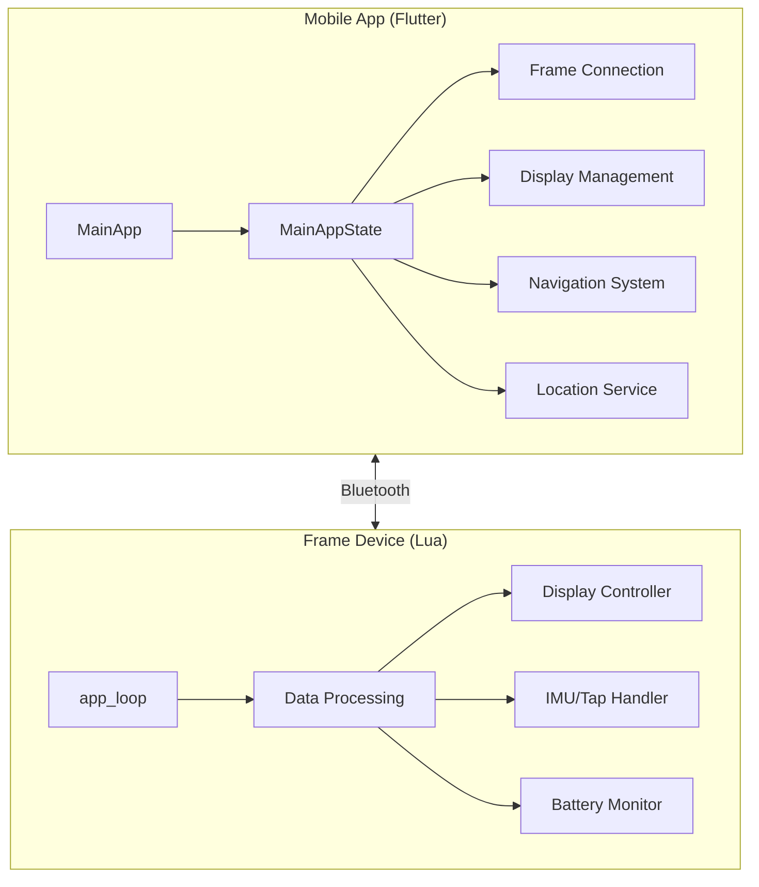
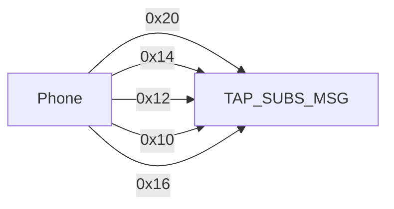
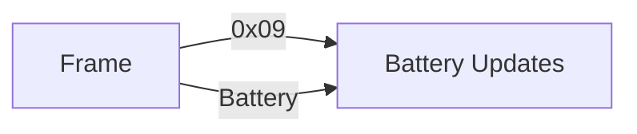
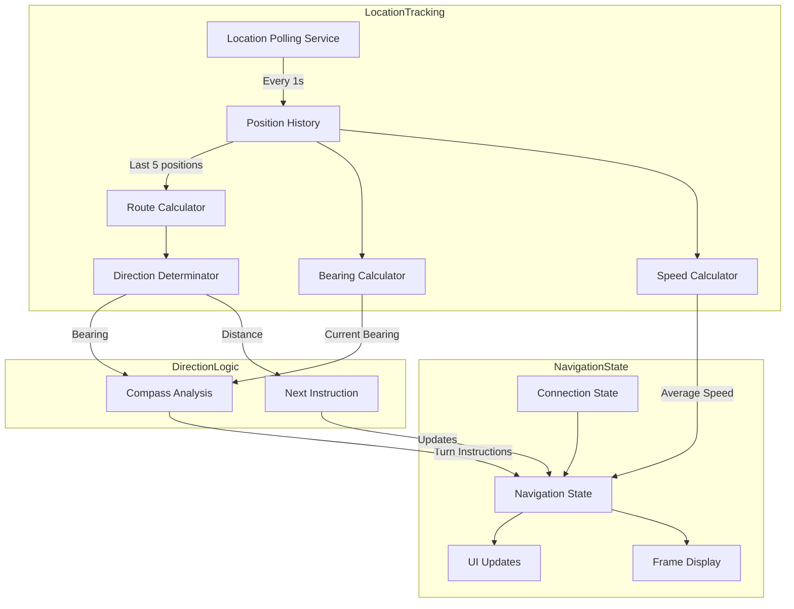
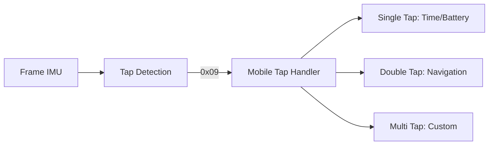
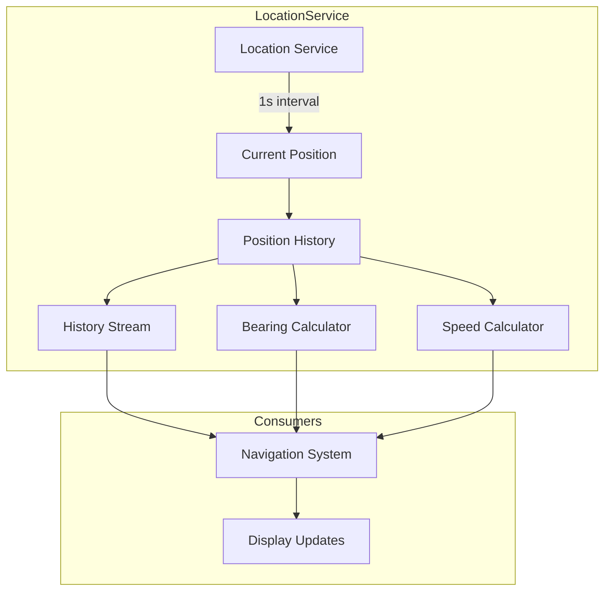
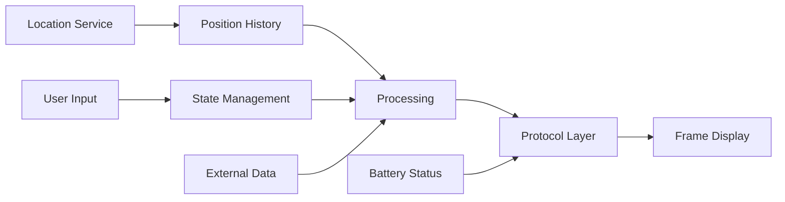

# System Patterns: nav_frame

## Architecture Overview

## Communication Protocol

### Phone to Frame Messages

### Frame to Phone Messages

## Navigation Tracking System

### Components:
1. **Location Tracking Service**
   - Asynchronous location updates stream
   - Position history management (max 5 positions)
   - 1-second polling interval
   - Two stream types:
     * locationStream: Single position updates
     * historyStream: List of recent positions

2. **Direction Calculator**
   - Bearing calculation between points
   - Average speed computation
   - Relative angle computation
   - Turn instruction generation
   - Uses position history for smoother calculations

3. **Navigation State Management**
   - Route data management
   - Progress tracking
   - Navigation status handling
   - Frame display integration
   - Position history integration

## Core Components

### 1. Mobile Application (Flutter)
- Uses SimpleFrameAppState mixin for lifecycle management
- State machine pattern for connection states:
  - disconnected → initializing → scanning → connecting
  - connected → running → ready
  - stopping → disconnecting

### 2. Frame Device (Lua)
- Main app_loop with error handling
- Message parser system
- Display management
- IMU/tap detection
- Battery monitoring
- Progressive sprite rendering

### 3. Display System
**Mobile Side:**
- Text message formatting
- Sprite/image preparation
- Clear screen control
- State-based UI updates

**Frame Side:**
- Text rendering
- Bitmap display
- Sprite handling
- Progressive rendering
- Palette management

### 4. User Input System

### 5. Location Services System

### 6. Navigation System
- Image processing via OpenCV
- Map interpretation
- Route guidance
- Visual feedback through frame display
- Position history integration for enhanced tracking

## Design Patterns

1. **State Pattern**
   - Mobile: Application state management
   - Frame: Display state management

2. **Observer Pattern**
   - Tap event handling
   - Battery monitoring
   - Bluetooth data monitoring
   - Location tracking streams

3. **Command Pattern**
   - Message passing system
   - Display operations
   - Navigation commands

4. **Queue Pattern**
   - Position history management
   - Limited size queue (5 positions)
   - FIFO operation

5. **Parser Pattern**
   - Message parsing system on frame
   - Data format handling

## Error Handling
- Mobile: Comprehensive logging system
- Frame: pcall error containment
- Graceful degradation
- Connection recovery
- Resource cleanup
- Location service error recovery

## Data Flow

## Security Considerations
- Bluetooth permissions management
- Location permissions handling
- Safe Lua script execution
- Error containment
- Resource cleanup on disconnect
- Progressive data handling
- Position data privacy
